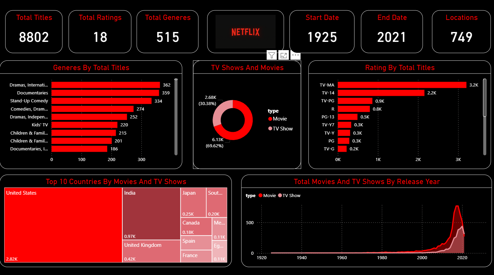

# 🎬 Netflix Movies and TV Shows Analysis Dashboard

A comprehensive Power BI project analyzing Netflix's global catalog of movies and TV shows. This dashboard provides insights into content trends, genres, release years, ratings, and top-producing countries — helping content strategists, media analysts, and entertainment companies understand audience preferences and global streaming trends.



---

## 📌 Key Insights

- 📅 **Content Growth** by Year  
- 🌎 **Top Countries** contributing content  
- 🎭 **Genre Distribution** (Movies vs TV Shows)  
- 🕵️‍♀️ **Filtering** by Type, Country, Rating, and Duration  
- 🔎 **Search-Friendly Visuals** using slicers and dynamic views

---

## 📁 Project Structure

```plaintext
Netflix-Movies-And-TV-Shows/
├── NetflixDashboard.pbix           # Power BI file
├── netflix_titles.csv              # Dataset from Kaggle
├── Dashboard.png                  # Dashboard snapshot
└── README.md                       # Project documentation
---

## 📊 Tools Used

- **Power BI** – For dashboard design and insights  
- **CSV Dataset** – Sourced from [Kaggle Netflix Dataset](https://www.kaggle.com/shivamb/netflix-shows)  
- **DAX & Data Cleaning** – Applied inside Power BI for filtering and transformation

---

## 🚀 How to Use

1. Clone this repo  
2. Open `NetflixDashboard.pbix` in Power BI Desktop  
3. Connect to the dataset if needed (`netflix_titles.csv`)  
4. Explore the visualizations and filters

---

## 📌 Author

**Jagdish Sutar**  
📧 [jagadishsutar20@gmail.com](mailto:jagadishsutar20@gmail.com)  
🔗 [LinkedIn](https://www.linkedin.com/in/jagdish-sutar/) | [Portfolio](https://jagdishsutar.vercel.app)

---

> ⭐ Star this repository if you found it insightful!  
> 💬 Feedback and suggestions are always welcome!
